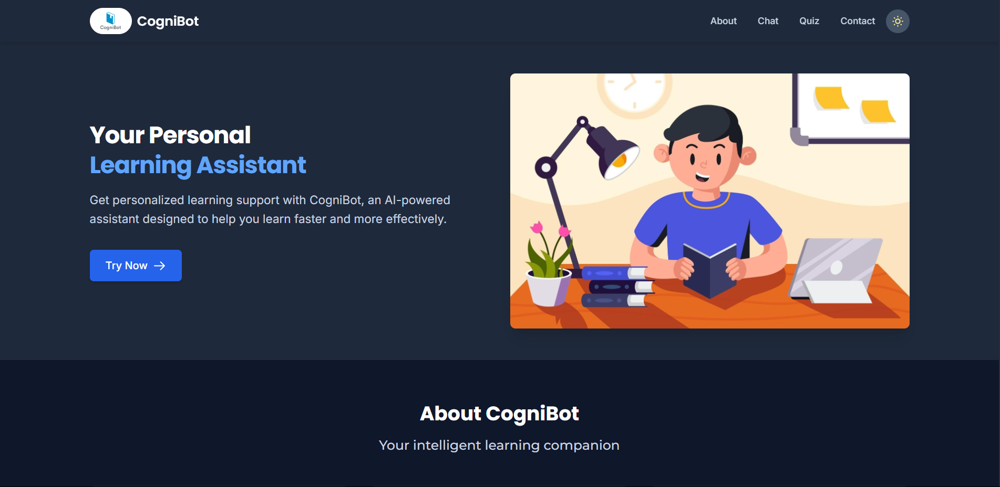

# CogniBot - AI Learning Assistant

## The Homepage-

CogniBot is an AI-powered learning assistant designed to help students and learners get personalized support for their educational needs. The web application features a clean, responsive interface with dark/light mode toggle and an interactive chatbot.

## The Chatbot UI page-

## Features

- 🎓 Personalized learning assistance
- 💬 Interactive chat interface with typing indicators
- 🌙 Dark/Light mode toggle
- 🎤 Voice input capability (UI ready for implementation)
- 📱 Responsive design for all device sizes
- ✨ Modern UI with Tailwind CSS

## Technologies Used

- **Frontend**: HTML5, CSS3, JavaScript
- **Styling**: [Tailwind CSS](https://tailwindcss.com/)
- **Fonts**: Google Fonts (Inter, Poppins, Montserrat)
- **Icons**: Heroicons

## Pages

1. **Homepage (index.html)**
   - Hero section with call-to-action
   - Feature highlights
   - About and Contact sections
   - Responsive navigation

2. **Chat Interface (chatbot.html)**
   - Interactive message bubbles
   - Typing indicators
   - Voice input button
   - Theme-consistent design

3. **Quiz Interface (quiz.html)**
   - Interactive message bubbles
   - Typing indicators
   - Interact and learn concepts with new daily quizzes.
   - Theme-consistent design
